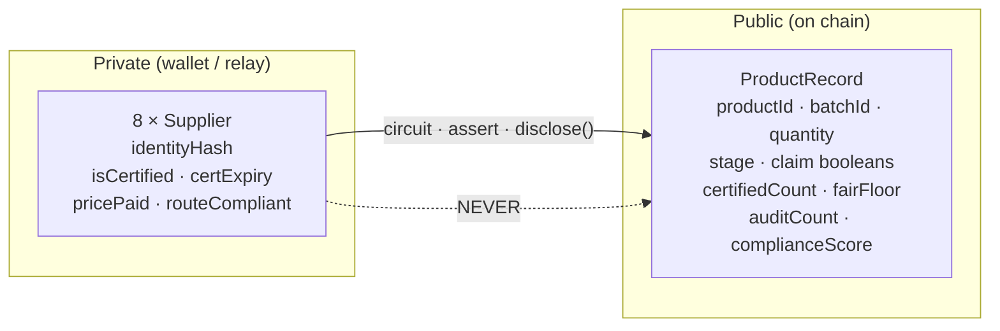

# ChainShield — Architecture

```mermaid
flowchart LR
    subgraph Company["Company side (private)"]
        WS[("Witness builder\nidentities · certs · expiries\nprices · routes")]
        RELAY["Proof relay (Node)\nsupply-chain.proof()\nbuffers wiped after prove"]
        CLI["CLI / relay client\nwallet-sk signs ownership"]
    end

    subgraph Chain["Midnight network"]
        CONTRACT["supply-chain.compact\n6 circuits"]
        LEDGER[("Public ledger\nMap<productId, ProductRecord>\nauthority (pk)")]
        SEALED[("sealed authority\ncompany public key")]
    end

    subgraph ReadSide["Read side (public)"]
        IDX["Indexer\nGraphQL :8088 / preview"]
        DASH["Dashboard (React + Vite)\nLedgerOverview · KPIs\nConsumerVerify · Prove panel"]
    end

    subgraph Actor["Observers"]
        REG["Regulator / auditor"]
        CONSUMER["Consumer (QR)"]
    end

    WS -->|private witness in-memory only| RELAY
    RELAY -->|circuit input| CONTRACT
    CLI -->|tx + proof| CONTRACT
    CONTRACT -->|disclose() only| LEDGER
    CONTRACT --> SEALED
    LEDGER --> IDX
    IDX --> DASH
    DASH --> REG
    DASH -->|productId → public claims| CONSUMER

    style Company fill:#1a2332,stroke:#7aa2f7
    style Chain fill:#12231a,stroke:#3fb950
    style ReadSide fill:#231a12,stroke:#f0a020
```

**Privacy boundary (dashed — nothing private crosses it):** the supplier vector
(`identityHash`, `isCertified`, `certExpiry`, `pricePaid`, `routeCompliant`)
exists only inside the wallet/relay while a proof is generated. What crosses:

- product/batch/quantity/stage metadata
- claim booleans (`isEthical`, `allCertified`, `allRoutesCompliant`, `fairPricing`)
- aggregate `certifiedCount` and committed `fairFloor`
- derived `complianceScore` + `auditCount`



## Data flow for one "Prove & publish"

1. Operator picks a circuit (e.g. `deliverProduct`) in the dashboard.
2. The private witness is built from local sourcing data (`lib/witness.ts`) —
   or, for the CLI/relay path, server-side in `api-server.ts` and dropped
   immediately (`wipeSuppliers`).
3. The proof is generated (relay runs `supply-chain.proof()`; browser path uses
   the connector if it exposes a providers adapter).
4. The transaction publishes `disclose()`d values only; the claim lands in
   `ledger products` at the current block.
5. The indexer serves the new `ProductRecord` to the dashboard — which is the
   exact view a regulator sees.

## Test surface (all offline & deterministic)

| File                        | Guards                                                                 |
| --------------------------- | ---------------------------------------------------------------------- |
| `tests/privacy.test.ts`     | `Ledger` type cannot carry private fields; witnesses are real           |
| `tests/adversarial.test.ts` | fail-closed asserts, relay ephemerality, no disclose of private fields |
| `tests/contract.test.ts`    | circuit gate behavior (score, expiry, stage machine)                   |
| `tests/suppliers.test.ts`   | witness builder invariants                                             |
| `tests/network.test.ts`     | network/faucet/deploy plumbing                                         |
| `frontend/src/api.test.ts`  | indexer decoding                                                        |
